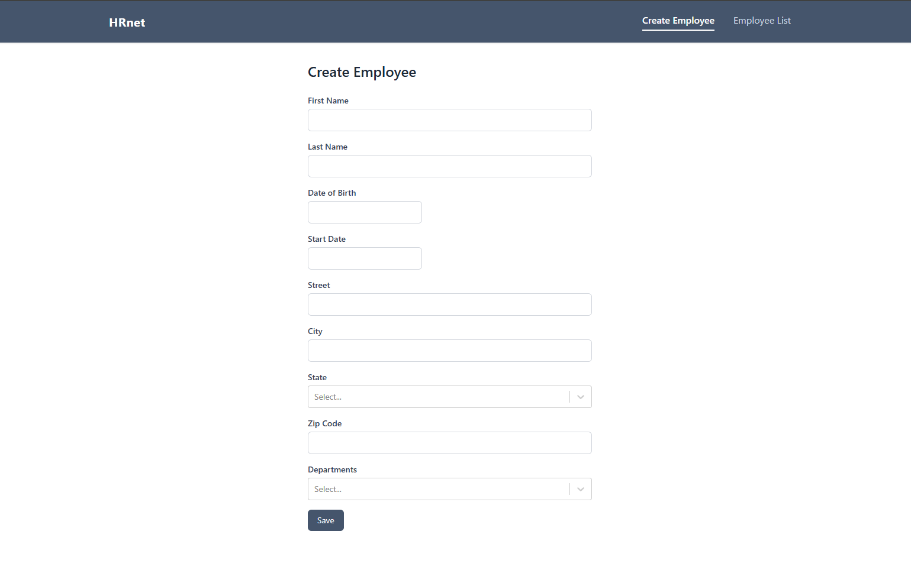
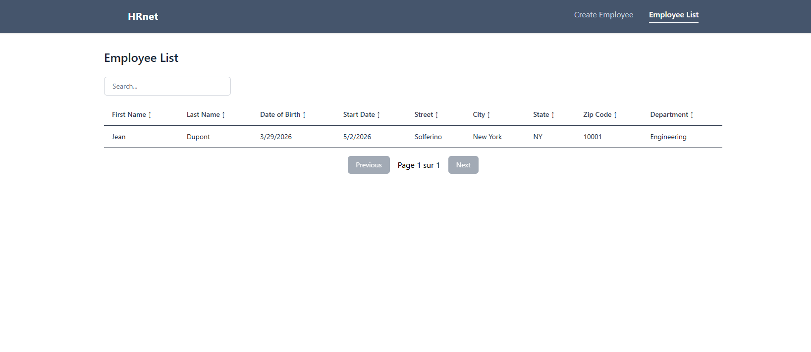
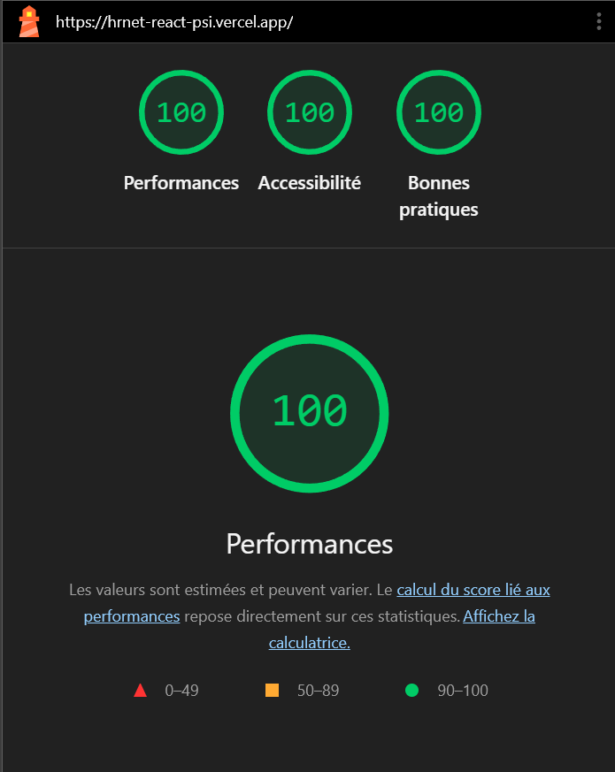

# HRnet — React

Migration of the HRnet internal HR application from jQuery to React for WealthHealth.

**Live demo** → [hrnet-react-psi.vercel.app](https://hrnet-react-psi.vercel.app)

---

## Screenshots

<p align="center">
  
  
</p>

---

## Lighthouse

<p align="center">
  
</p>

---

## Stack

| Layer       | Technology                                              |
|-------------|---------------------------------------------------------|
| Framework   | React 19 + Vite 8                                       |
| Routing     | React Router v7                                         |
| State       | Zustand (localStorage persistence)                      |
| Table       | TanStack Table v8 (sort, filter, pagination)            |
| Date picker | react-datepicker                                        |
| Select      | select-mtdev2024 (replaces jQuery UI selectmenu)        |
| Modal       | modal-mtdev2024 (replaces jquery.modal)                 |
| Styling     | Tailwind CSS v4                                         |

---

## Features

- Create Employee form with 9 fields and validation
- Employee List with search, sort and pagination
- Data persisted in localStorage via Zustand
- Fully accessible — 100/100 Lighthouse accessibility score
- 0% jQuery, 100% React

---

## Getting Started

```bash
npm install
npm run dev
```

## Production Build

```bash
npm run build
npx serve dist --single
```

---

## Related

- [modal-mtdev2024](https://www.npmjs.com/package/modal-mtdev2024) — npm package
- [react-hrnet-modal](https://github.com/MTDev2024/react-hrnet-modal) — modal component repo
- [select-mtdev2024](https://www.npmjs.com/package/select-mtdev2024) — npm package
- [react-hrnet-select](https://github.com/MTDev2024/react-hrnet-select) — select component repo

---

## License

MIT © 2026 Michael Takbou

---

## Author

Michael Takbou · [LinkedIn](https://www.linkedin.com/in/michael-takbou/) · [Malt](https://www.malt.fr/profile/michaeltakbou)